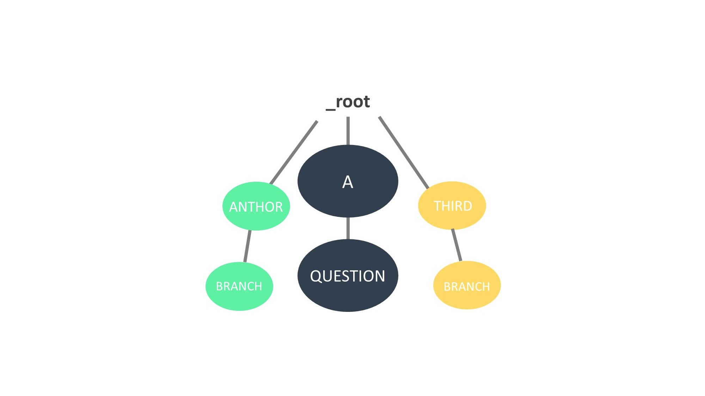

# 对 learn 函数中生成元素树的分析

在 Kernel.py 中的 learn 函数负责学习 aiml 文件中的内容，上一小结提到了如何将文件中的内容解析、入栈、形成一个字典，这里主要讲解接下来的步骤：将字典内的键值对按照规则进行组织，形成树形结构。

```python
for key,tem in handler.categories.items():
	self._brain.add(key,tem)
```

python 中没有 C 语言中的链表数据结构，这里生成的树形结构是通过构造字典实现的，只不过每个父节点不再使用指针指向子节点，而是把后代作为键值对中的 value 进行存储。


## 字典结构

最终形成的元素树，是从根节点 _root 开始的多个巨大的子节点，像俄罗斯套娃一样一层层包裹着子节点。

当原始 aiml 内容为：

```xml
<?xml version = "1.0" encoding = "UTF-8"?>
<aiml version="1.0">
<category><pattern>A QUESTION</pattern>
<template> hello again </template>
</category>
</aiml>
```

下图展示了此时 _root 字典中的内容。若有其他的 category 知识单元，且其中的 pattern 不是以 "A" 开头，则会有其他与此结点同层次的结点存在。


> 若图像不清晰，可以右键点击图片-在新标签页中打开图片，查看大图

为了方便起见，我们仍使用简单的树形结构来解释整个生成过程。


## 过程跟踪

在 Kernel 中的 _brain 其实是 PatternMgr 类的一个实例，树形结构的维护通过其中的 add 方法实现。

```python
def add(self, (pattern,that,topic), template):
	# Navigate through the node tree to the template's location, adding
	# nodes if necessary.
	node = self._root
	for word in string.split(pattern):
		key = word
		if key == u"_":
			key = self._UNDERSCORE
		elif key == u"*":
			key = self._STAR
		elif key == u"BOT_NAME":
			key = self._BOT_NAME
		if not node.has_key(key):
			node[key] = {}
		node = node[key]
```

node 变量类似一个指针对象，帮助从 _root 向下进行遍历。

第一部分代码，分解 pattern，前一个单词作为父节点指向下一个单词。




```python
# navigate further down, if a non-empty "that" pattern was included
if len(that) > 0:
	if not node.has_key(self._THAT):
		node[self._THAT] = {}
	node = node[self._THAT]
	for word in string.split(that):
		key = word
		if key == u"_":
			key = self._UNDERSCORE
		elif key == u"*":
			key = self._STAR
		if not node.has_key(key):
			node[key] = {}
		node = node[key]
```

第二部分，进行 that 内容的拆分，进一步向下构建树。注意在开始分解 that 的内容之前，添加了一个 key = self._THAT 的结点，整数型的 _THAT（预定义常量）作为 that 内容正式开始的依据，以便之后进行解析匹配。

由于读入的 aiml 文件中没有 that 标签，此时的 that 值实际上为 "\*"，并在树中形成了一个 _STAR （预定义常量 1）结点，即通配符 "\*"，用以匹配任意的 that 内容。


```python
# navigate yet further down, if a non-empty "topic" string was included
if len(topic) > 0:
	if not node.has_key(self._TOPIC):
		node[self._TOPIC] = {}
	node = node[self._TOPIC]
	for word in string.split(topic):
		key = word
		if key == u"_":
			key = self._UNDERSCORE
		elif key == u"*":
			key = self._STAR
		if not node.has_key(key):
			node[key] = {}
		node = node[key]
```

第三部分针对 topic 标签，同样增加一层表示 _TOPIC（预定义常量 4）和一层代表 "*" 的 _STAR。


```python
# add the template.
if not node.has_key(self._TEMPLATE):
	self._templateCount += 1
node[self._TEMPLATE] = template
```

最终，添加 template 的内容，当然在这之前，要先加上 _TEMPLATE （常量 2）。


对以下内容进行测试：

```xml
<?xml version = "1.0" encoding = "UTF-8"?>
<aiml version="1.0">
<category><pattern>USER QUESTION</pattern>
<template> hello </template>
</category>
<category><pattern>USER ANOTHER</pattern>
<template> hello again</template>
</category>
</aiml>
```

得到树形结构：

