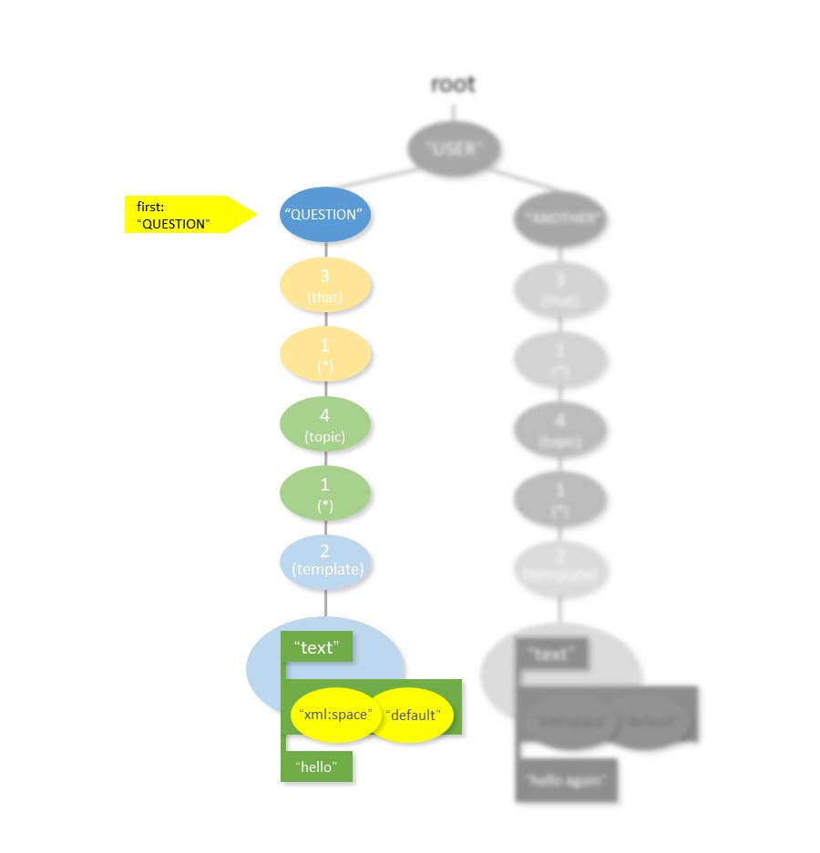
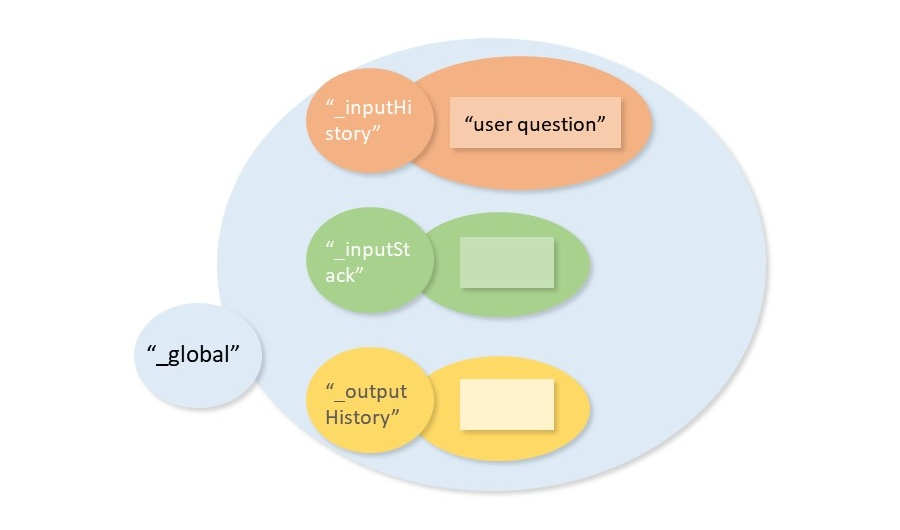

# 基本的 response 过程

对以下 aiml 文件内容进行分析：

```xml
<?xml version = "1.0" encoding = "UTF-8"?>
<aiml version="1.0">
<category><pattern>USER QUESTION</pattern>
<template> hello </template>
</category>
<category><pattern>USER ANOTHER</pattern>
<template> hello again</template>
</category>
</aiml>
```

形成如下对话：

```
Enter your message >> user question
hello
```


## 初步处理

在 Kernel.respond 方法中：

```python
"""Return the Kernel's response to the input string."""
if len(input) == 0:
    return ""

#ensure that input is a unicode string
try: input = input.decode(self._textEncoding, 'replace')
except UnicodeError: pass
except AttributeError: pass
        
# prevent other threads from stomping all over us.
self._respondLock.acquire()
```

首先进行常规的输入检测，保证输入内容不为空、编码为 Unicode，并且通过 python 自带的线程处理类对资源进行加锁处理。关于 `self._respondLock.acquire()` 详情参考 [Python线程同步机制](http://yoyzhou.github.io/blog/2013/02/28/python-threads-synchronization-locks/) 。

之后的代码

```python
# Add the session, if it doesn't already exist
self._addSession(sessionID)
```

是对于 self._sessions 维护的一部分。 **\_sessions 负责保存多次会话的详细内容**，用于 that、topic 等标签的匹配。默认的会话都保存在 sessionID 为 "\_global" 的记录中。

!>  **实际上，respond 功能含有大量的对 _sessions 的维护。在这里先将匹配过程抽离出来进行分析，并认为使用到的 _sessions 内容已经维护过。**

接下来通过

```python
# split the input into discrete sentences
sentences = Utils.sentences(input)
```

对用户输入的多句话进行分割，借助标点符号完成。ALICE 将对每句话进行分别回答。


## 匹配过程

在 respond 函数中调用 _respond 函数，进行真正的工作：

```python
response = self._respond(s, sessionID)
```


### Kernel._respond 方法

由于会话是第一次发生，在 Kernel._respond 函数中获取到代表输出历史记录的 outputHistory 为空列表。相应的，获取到的 that 内容为空字符串。

```python
outputHistory = self.getPredicate(self._outputHistory, sessionID)
try: that = outputHistory[-1]
except IndexError: that = ""
```

同理，紧接着获取的 topic 也是空字符串。

继续向下，调用 PatternMgr 中的 match 方法进行最终回复的确认：

```python
response = ""
elem = self._brain.match(subbedInput, subbedThat, subbedTopic)
```

传入参数中 subbedThat、subbedTopic 分别是对 that、topic 进行规范化词语替换得到（参考下方详细分析）。


### PatternMgr.match 方法

该方法中对每个单句进行初步处理，之后会调用 _match 方法进行匹配。

```python
if len(pattern) == 0:
	return None
			
input = string.upper(pattern)
input = re.sub(self._puncStripRE, " ", input)
```

确认句子不是空字符串后，将句子转换为全大写字母，并去除标点符号。

当检查到 that 和 topic （上一函数中的 subbedThat、subbedTopic ）为空时，分别为它们进行赋值处理：

```python
if that.strip() == u"": that = u"ULTRABOGUSDUMMYTHAT"
	
# 省略中间步骤

if topic.strip() == u"": topic = u"ULTRABOGUSDUMMYTOPIC"
```

接下来调用 _match 方法。

```python
patMatch, template = self._match(input.split(), thatInput.split(), topicInput.split(), self._root)
```

有关 that 和 topic 的作用，参考 [that 标签](that标签.md) 和 [topic 标签](topic标签.md) 。


### PatternMgr._match 方法

在 Kernel.respond 中用户的输入被拆分为一个个句子进行处理，在 _match 方法中这些句子进一步被拆分为一个个单词进行匹配。

此时函数入口：

```python
def _match(self, words, thatWords, topicWords, root):
```

参数 words，thatWords，topicWords 因为被 string.split 处理过，分别为三个字符串列表 `[u'USER', u'QUESTION']` ，`[u'ULTRABOGUSDUMMYTHAT']` ，`[u'ULTRABOGUSDUMMYTOPIC']` ；参数 root 即通过读取 aiml 文件构建出的树形结构，参考 [规则树构建](learn函数生成元素树的分析.md) 。


由于初始 words 不为空，跳过一段代码，执行：

```python
first = words[0]
suffix = words[1:]
```

first 取第一个单词 "USER"，suffix 为剩余列表 `[u'QUESTION']` 。

首先检查 root 中是否含有 "\_" 符号，"\_" 可以匹配任意一个单词。

```python
# Note: this is causing problems in the standard AIML set, and is
# currently disabled.
if root.has_key(self._UNDERSCORE):
	for j in range(len(suffix)+1):
		suf = suffix[j:]
		pattern, template = self._match(suf, thatWords, topicWords, root[self._UNDERSCORE])
		if template is not None:
			newPattern = [self._UNDERSCORE] + pattern
			return (newPattern, template)
```

如果在树中遇到一个 "\_" 结点，将从 suffix 的后一个元素开始继续匹配。根据注释，似乎现在的 pyaiml 代码对标准 aiml 集中的 "\_"解析会造成错误。关于 "\_" 的部分不做过多解释，接下来开始对 first 的匹配。

```python
if root.has_key(first):
	pattern, template = self._match(suffix, thatWords, topicWords, root[first])
	if template is not None:
		newPattern = [first] + pattern
		return (newPattern, template)
```

递归一次，现在 first 的内容是 "QUESTION"，suffix 为空列表。

!> _match 方法是一个递归函数，每次调用都会进入数的下一层结点。通过不断调用自己，逐层向下遍历树形结构进行匹配。

当前的匹配情况如下：



当 _match 再一次递归时，words 已经成为空列表，进入最开始部分的代码段。

```python
if len(words) == 0:
	pattern = []
	template = None
	if len(thatWords) > 0:
		try:
			pattern, template = self._match(thatWords, [], topicWords, root[self._THAT])
			if pattern != None:
				pattern = [self._THAT] + pattern
		except KeyError:
			pattern = []
```

事实上，这里的代码匹配过程也是一种有限状态机的状态转换过程。由于输入单词用尽，解析方法进入了解析 that 的阶段。而能够成功匹配的条件就是：语法树此时也进入到了记录 that 的结点。


!> **两个状态机同步进行状态转换，最终完成结果的索引。**

代码完成了又一次 _match 方法的递归，即进行了结点的下移，此时的情形如下：


注意参数填写的顺序，此时 that 充当了 words，但这并不是状态回退，而是为了起到复用代码的作用。

经过多次判断，程序运行到了：

```python
if root.has_key(self._STAR):
	for j in range(len(suffix)+1):
		suf = suffix[j:]
		pattern, template = self._match(suf, thatWords, topicWords, root[self._STAR])
```

经过这步递归调用，_STAR （即 "\*" 通配符）“吃掉”了 that 中的一个单词内容。

随着程序检查到 words 和 that 的内容均为空，状态转换到了 topic 的匹配阶段。这一阶段与 that 相同，不做赘述。

最后一次的递归调用，原始输入的 words、that、topic 全部用尽，程序开始进行 template 状态的匹配：

```python
if template == None:
	pattern = []
	try: template = root[self._TEMPLATE]
	except KeyError: template

return (pattern, template)
```

至此，我们获取到了 template 中的内容，列表 `['template', {}, ['text', {'xml:space': 'default'}, u' hello ']]` ，与之同时记录的是为空列表的 pattern 。

递归开始不断向上返回：

```python
if template is not None:
	newPattern = [self._STAR] + pattern
	return (newPattern, template)
```

对 _STAR 的匹配向 pattern 追加了 "\*" 的记录（表示为整数 1）。随着递归栈的弹出，pattern 也不断被写入栈中的记录。


### _processElement 整合内容

当 template 列表被递归栈返回到 \_respond 中时，使用了self._processElement 方法对它进行处理。

```
['template', {}, ['text', {}, ['text', {'xml:space': 'default'}, u' hello ']]]
```

该函数内部使用的是 handlerFunc 方法，handlerFunc 的具体内容由列表的第一项决定。

```python
handlerFunc = self._elementProcessors[elem[0]]
```

handlerFunc 从 _elementProcessors 中选择函数实例：

```python

self._elementProcessors = {
    # 省略内容...
    . . .
    "random": self._processRandom,
    "text": self._processText,
    "sentence": self._processSentence,
    "set": self._processSet,
    "size": self._processSize,
    "sr": self._processSr,
    "srai": self._processSrai,
    "star": self._processStar,
    "system": self._processSystem,
    "template": self._processTemplate,
    "that": self._processThat,
    . . .
    # 省略内容...
}
```

可以看出程序预定义了各种处理元素列表的方法，现在 handlerFunc 指向 _processText 方法。

```python
def _processTemplate(self,elem, sessionID):
    response = ""
    for e in elem[2:]:
        response += self._processElement(e, sessionID)
    return response
```

程序直接取出第三个元素`['text', {'xml:space': 'default'}, u' hello ']` ，再次调用 _processElement 方法，这次索引的 key 为 "text"，调用 _processText 方法：

```python
def _processText(self,elem, sessionID):
    try: elem[2] + ""
    except TypeError: raise TypeError, "Text element contents are not text"
    if elem[1]["xml:space"] == "default":
        elem[2] = re.sub("\s+", " ", elem[2])
        elem[1]["xml:space"] = "preserve"
```

此时的 elem 为列表 `['text', {'xml:space': 'preserve'}, u' hello ']` ，程序首先检查第三部分是否为字符串，然后根据 'xml:space' 的属性进行空白符的处理。

>#### 关于空白符
>
>xml:space内置属性则是用于设置应用程序该如何处理解析器传递的空格等字符，它是一个Enumerated类型的属性，值只能是 defualt 和 preserve，defualt表示应用程序可以自行随意处理空格等字符，而preserve 则表示应用程序应该把空格等字符当做普通文本字符处理。默认值为 default 。

此时的 'xml:space' 记录 value 为 'default' ，表明字符串中的空白符不需要保留原始数量（某些情况下可能在回答中包含连续多个空白符）。

使用正则对象：

```python
elem[2] = re.sub("\s+", " ", elem[2])
```

将答复里的多个连续空白符替换为单个空格。并将 'xml:space' 改为 'preserve' ，以避免重复修改。


### 完成输出

递归调用再次开始向外出栈，此时返回的内容为字符串 ' hello '。过程中使用 string.strip() 去除前后的多余空格，不做过多叙述。

最终，程序输出了 finalResponse ，即回复 `hello` ，我们完成了一次最简单的对话过程跟踪分析。对话内容：

```
Enter your message >> user question
hello
```


## 维护 _sessions (会话记录)

为了提供对上下文相关的支持，需要使用一种机制来进行最近数次对话的记录，这就是 _sessions 对象的作用。


### 初始化

_sessions 的初始化可以追溯到 Kernel 类的实例创建。

```python
self._sessions = {}
self._addSession(self._globalSessionID)
```

在没有指定 sessionID 的情况下，设为默认值 _globalSessionID （值为"\_gloabl"）。sessionID 的设定是为了进行不同对话的区分，以区别不同的用户。\_addSession 方法判断当前的 _sessions 为空，为其赋初值：

```python
self._sessions[sessionID] = {
    # Initialize the special reserved predicates
    self._inputHistory: [],
    self._outputHistory: [],
    self._inputStack: []
}
```


在 respond 循环调用的代码时，可以重新设定 sessionID 。

入口循环：

```python
while True:
    print alice.respond(raw_input("Enter your message >> "))
```

respond 函数：

```python
def respond(self, input, sessionID = _globalSessionID):
    # 省略内容...
    self._addSession(sessionID)
```


### 维护过程

在 respond 函数中完成了输入分句后，在每句话匹配并获取回复回复前都进行了添加 inputHistory 的操作：

```python
for s in sentences:
    inputHistory = self.getPredicate(self._inputHistory, sessionID)
    inputHistory.append(s)
    while len(inputHistory) > self._maxHistorySize:
        inputHistory.pop(0)
    self.setPredicate(self._inputHistory, inputHistory, sessionID)
```

其中使用的 getPredicate 函数是很简单的字典索引，取出 \_sessions 中的一个 value：

```python
def getPredicate(self, name, sessionID = _globalSessionID):
    try: return self._sessions[sessionID][name]
    except KeyError: return ""
```

而 setPredicate 方法是将取出并扩充过的值放回 \_sessions ：

```python
def setPredicate(self, name, value, sessionID = _globalSessionID)
    self._addSession(sessionID) # add the session, if it doesn't 
    self._sessions[sessionID][name] = value
```

程序中 \_addSession 方法很多次被调用，只是检查当前是否有指定的 \_sessionID 对话，如果没有则添加并进行初始化。而本例中一直使用默认的 \_globalSessionID，所以并未发生作用。

此时的 \_sessions：



接下来调用 \_respond ，其中含对 \_sessions 的维护与使用。

#### _respond 方法中对 _sessoins 的使用

> This version of \_respond() just fetches the response for some input. It does not mess with the input and output histories.  Recursive callsto respond() spawned from tags like &lt;srai&gt; should call this functioninstead of respond().

根据 _respond 方法的注释可以了解到，将该方法解耦出来是为了在递归过程调用中不将 _sessions 中的历史记录弄乱。此时发挥重要作用的字典 \_inputStack 发挥了记录的作用，从而避免修改 \_inputHistory 。

```python
inputStack = self.getPredicate(self._inputStack, sessionID)
inputStack.append(input)
self.setPredicate(self._inputStack, inputStack, sessionID)
```

将第一句话放入 \_inputStack 。


接下来的操作是对输入内容进行词语替换以标准化：

```python
subbedInput = self._subbers['normal'].sub(input)
```

参见本页最后一部分 **使用 sub 方法进行词语替换** 。

根据 [that 标签](that标签.md) 的作用，可以知道实际上 that 就是上一**句** ALICE 的回复。

```python
outputHistory = self.getPredicate(self._outputHistory, sessionID)
try: that = outputHistory[-1]
except IndexError: that = ""

subbedThat = self._subbers['normal'].sub(that)
```

从 \_seesions 中获取上一句回复，进行标准化词语替换后作为与语法树匹配的 subbedThat 。由于是第一次对话，获取到的是空字符串。

接下来获取 topic ，仍使用 getPredicate 方法：

```python
topic = self.getPredicate("topic", sessionID)
subbedTopic = self._subbers['normal'].sub(topic)
```

显然 _sessions 中没有 "topic" 键值对，topic 被设置为空字符串。

程序在获取到 response 之后，将 \_sessions 中暂存的 \_inputStack 内容清空：

```python
inputStack = self.getPredicate(self._inputStack, sessionID)
inputStack.pop()
self.setPredicate(self._inputStack, inputStack, sessionID)
```

因此当最终从 \_respond 方法返回后，\_sessions 应该保持进入前的状态没有改变。

接下来，把获取到的 response 存入 \_sessions 的 _outputHistory ：

```python
outputHistory = self.getPredicate(self._outputHistory, sessionID)
outputHistory.append(response)
while len(outputHistory) > self._maxHistorySize:
    outputHistory.pop(0)
self.setPredicate(self._outputHistory, outputHistory, sessionID)
```

超过预定数目时，旧的记录会被删除。


#### 第二次对话

进行以下对话：

```
Enter your message >> user question
hello
Enter your message >> user another
hello again
```

此时 \_sessions 中的内容如下：


## 使用 sub 方法进行词语替换

在 Kernel.\_respond 方法中，出现了下面的 sub 方法：

```python
subbedInput = self._subbers['normal'].sub(input)
```

这里的 \_subbers 也是一个字典，随着 Kernel 实例创建（Kernel.\_\_init\_\_）进行初始化。

```python
self._subbers = {}
# 省略内容...
self._subbers['normal'] = WordSub(DefaultSubs.defaultNormal)
```

WordSub 是用于单词替换的工具类，在此处代码中进行了 normal 字典的加载：

```python
# WordSub.__init__ 方法
def __init__(self, defaults = {}):
    self._regex = None
    self._regexIsDirty = True
    for k,v in defaults.items():
        self[k] = v
```

而所加载的 DefaultSubs 则是多个用于词语替换的字典，如：

```python
defaultNormal = {
    "wanna": "want to",
    "gonna": "going to",
    "I'm": "I am",
    "I'd": "I would",
    "I'll": "I will",
    "I've": "I have",
    "you'd": "you would",
    "you're": "you are",
    "you've": "you have",
    "you'll": "you will",
  
    # 省略内容...
}
```

这样来看，sub 方法的作用很明显，就是将用户输入中的常见的缩写等，替换为更加完全、更符合 aiml 文件中 pattern 规则的形式，以提高 ALICE 回复匹配的命中率。
